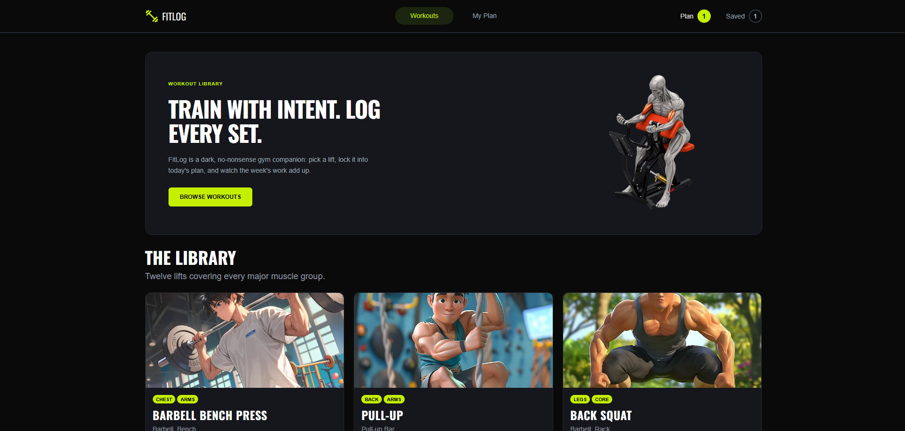
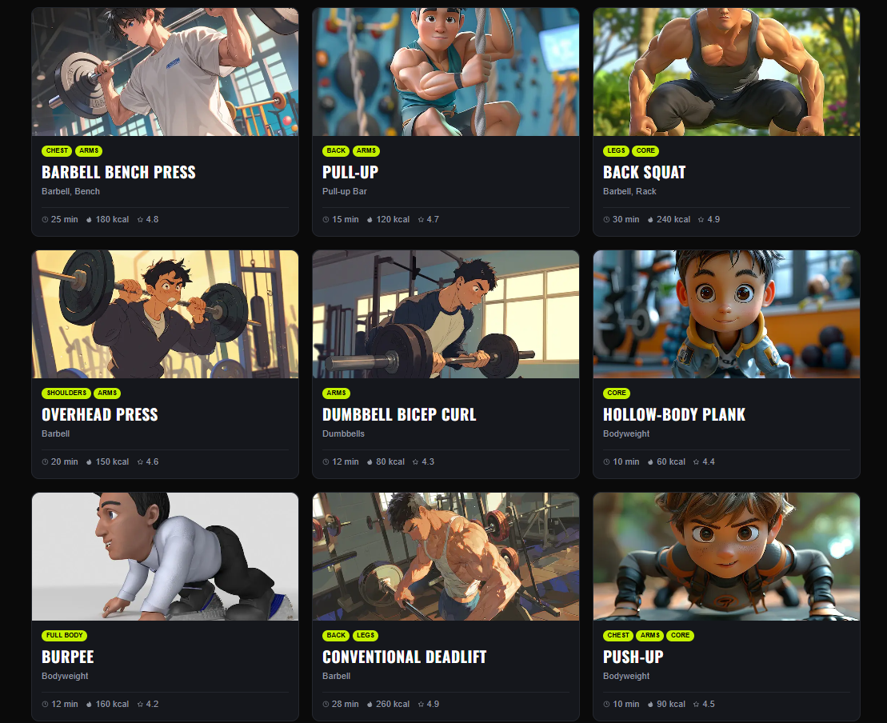

<div align="center">

# 💪 FitLog

### Train With Intent. Log Every Set.

A responsive workout library and planning application built with Next.js.  
FitLog allows users to explore workouts, view detailed exercise information, create a daily workout plan, save exercises for later, track workout metrics, and manage their training through a responsive dark-themed interface.

### 🔗 [Live Website](https://fitlog-eosin-kappa.vercel.app/) • [GitHub Repository](https://github.com/Ayman392/Fitlog)

</div>

---

## 📸 Project Preview



<br />



---

## 📖 About The Project

**FitLog** is a workout library and daily workout planning application built using **Next.js**.

Users can browse a library of twelve workouts, open detailed exercise pages, add workouts to **Today's Plan**, save workouts for later, monitor workout metrics, and manage their selected exercises from the **My Plan** page.

The application follows a dark, gym-focused interface and is designed to work across mobile, tablet, and desktop screen sizes.

---

## ✨ Key Features

### 🏋️ Workout Library

- Displays **12 workouts** from the FitLog API.
- Responsive workout-card layout.
- Each card displays:
  - Exercise image
  - Category tags
  - Workout name
  - Equipment
  - Duration
  - Calories
  - Rating
- Clicking a workout opens its detailed page.

### 📖 Workout Details

Each workout has a dedicated details page containing:

- Large workout image
- Workout title and description
- Category tags
- Equipment
- Difficulty
- Sets
- Repetitions
- Duration
- Calories
- Rating
- Step-by-step instructions

Users can perform two main actions:

- **Add to Today's Plan**
- **Save for Later**

### 📅 Today's Plan

Users can add exercises to their daily workout plan.

The plan provides:

- Selected workout list
- Exercise information
- View Details option
- Mark as Done action
- Remove action
- Toast notifications for relevant actions

### ❤️ Saved Workouts

Users can save exercises for later and access them from the **Saved** tab of the My Plan page.

The Saved counter in the navbar updates based on the number of saved exercises.

### 📊 Live Workout Metrics

The **My Plan** page calculates and displays:

- Total Exercises
- Total Minutes
- Total Calories

These metrics update as workouts are added to or removed from Today's Plan.

### 🔢 Dynamic Navbar Counters

The navbar contains two status counters:

- **Plan**
- **Saved**

The counters update according to the number of workouts currently in each collection.

### 🔀 Workout Sorting

The workout list can be sorted using the **Sort By** control.

Available sorting options:

- Duration
- Calories
- Rating

### 🔔 Toast Notifications

Relevant toast notifications provide feedback when users:

- Add a workout to Today's Plan
- Save a workout
- Mark a workout as done
- Remove a workout

### ⏳ Loading States

Loading feedback is displayed while workout information is being fetched.

### 🚫 Custom 404 Page

Unknown or invalid routes display a custom **404 page** instead of an application error.

### 📱 Responsive Design

FitLog is designed to work across:

- Mobile
- Tablet
- Desktop

The workout grid, navbar, hero section, details page, and My Plan interface adapt to different screen sizes.

---

## 🧭 Main Pages

| Page | Route | Purpose |
|---|---|---|
| Home | `/` | Browse the workout library |
| Workout Details | Dynamic workout route | View complete workout information |
| My Plan | `/my-plan` | Manage Today's Plan and Saved workouts |
| 404 | Invalid routes | Handle unknown pages |

---

## 🛠️ Technologies Used

<p align="left">
  
</p>

| Technology | Purpose |
|---|---|
| **Next.js** | Application framework |
| **React** | Component-based user interface |
| **TypeScript** | Type-safe development |
| **Next.js App Router** | Application routing |
| **Tailwind CSS** | Styling and responsive design |
| **DaisyUI** | UI component styling |
| **FitLog API** | Workout data |
| **Vercel** | Application deployment |

---

## 🌐 API

Workout information is retrieved from the FitLog API.

### All Workouts

```text
https://api.abcz.workers.dev/api/fitlog
